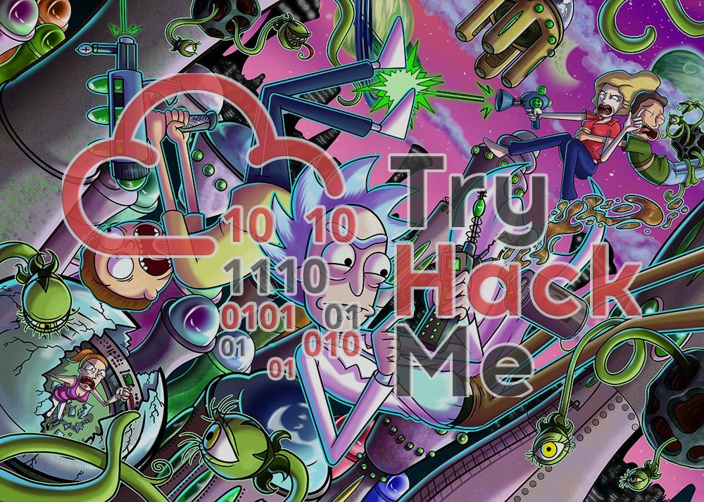

# TryHackMe - Pickle Rick
A Rick and Morty CTF. Help turn Rick back into a human!

## Initial Reconnaissance:
We begin by conducting a thorough reconnaissance using Nmap to identify any potential entry points. The Nmap scan reveals two open ports: 22 (SSH) and 80 (HTTP).

    nmap -sS -A -T4 -p- 10.10.87.195

## Web Application Analysis:
With port 80 hosting an HTTP service, we navigate to the website and inspect the page source. In the source code, we discover a username, "R1ckRul3s," which we note down for potential login use. Additionally, examining the "robots.txt" file yields a potential password: "Wubbalubbadubdub."

## Directory Enumeration:
Utilizing Gobuster, we conduct directory enumeration to discover hidden directories or files within the web server. The enumeration reveals the existence of "login.php," which we investigate further.

    gobuster dir -u http://10.10.87.195 -x txt,php,html -w /usr/share/wordlists/dirbuster/directory-list-2.3-medium.txt -t 100

## Web Application Exploitation:
Upon accessing the login page with the discovered username and password, we gain access to a control panel allowing command execution. After executing ls, we identify several interesting files, including "Sup3rS3cretPickl3Ingred.txt," "portal.php," and "clue.txt." Attempts to view the contents of "Sup3rS3cretPickl3Ingred.txt" fail due to command filtering.

## Command Injection Evasion:
We employ command injection evasion techniques to bypass the filtering mechanism and successfully access the contents of "Sup3rS3cretPickl3Ingred.txt," obtaining the first ingredient.

## Further Exploration:
We explore the functionality provided by "portal.php" and discover a list of blocked commands. Leveraging the allowed command "less," we access files and retrieve the second ingredient from the home directory of the user "rick."

## Privilege Escalation:
Investigating the user's permissions, we find that the user "rick" can execute commands as root without a password. With this newfound privilege, we access the root directory and retrieve the third ingredient from "3rd.txt."

## Alternative Approach:
Alternatively, we set up a reverse shell to gain interactive access to the target system. With the reverse shell established, we navigate through the filesystem to locate and retrieve the ingredients.

## Conclusion:
Through meticulous reconnaissance, web application analysis, command injection evasion, and privilege escalation, we successfully obtained all three ingredients required for Rick's potion. This demonstrates the importance of thorough reconnaissance, effective exploitation techniques, and leveraging discovered vulnerabilities to achieve the desired objectives.