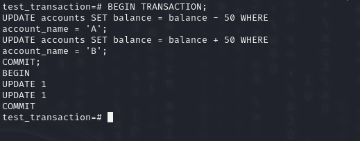

# Topic: ACID Properties of Transaction.

## ACID Properties:
### Consistency:
Maintains equal and opposite balances in account A and B by adding, subtracting or making deposits and withdrawals.

### Atomicity:
It guarantees that all sub-processes of the transaction are performed or none of them are (all-or-nothing principle).

### Durability:
Confirms that after the changes have been committed in a particular transaction, they will remain even when the system crashes.

### Isolation:
Makes sure that multiple transactions lead to the state that would be produced if the operations were to run sequentially.

### Atomicity Example:
Scenario: Failure occurs after write(A) but before write(B).
Values: A = $950, B = $2000 (inconsistent state).
Solution: The database system logs old values and restores them in case of a failure.

### Ensuring Durability:
Methods:
Include updates to disk before the transaction is finished.
To be able to revert to the specific transactions in case of a failure, record the following information:

### Isolation Example:
Scenario:
Transaction T1 reads data in A and B and performs addition on them in order to get an answer.
Interleaving transaction T2 uses the value of A and B from the other inconsistent transaction.
Solution: Do the transactions one after the other or use methods to manage concurrent processing for isolation.

### A Simple Transaction Model
This transaction I prefer to perform in postgreSQL

It is to mention that, create a database with the name test_transaction.
Switch to the test_transaction database.
Open a new table and name it accounts and include the two columns as follows;
Insert initial balances: and $1000 for ‘A’ account and $2000 for the ‘B’ account.

Display all accounts.
Begin a transaction.
Reduce the balance of account ‘A’ by $500.
Set the balance of account ‘B’ by adding $500.
Spend the money, lock these changes in.
Return to see all accounts that should be rebalanced, again.

## Transaction Atomicity and Durability
A simple abstract transaction model:

### Transaction States and Examples
## Active:
The transaction is executing at the moment.
The transaction is already in progress and is an updating transaction in the account ‘A’.

## Partially Committed:
A transaction may have occurred and has run its course; however, it is still not irreversible. Transaction has included another account ‘B’ with initial balance $500 and is in the stage of posting.

### Failed:
An attempt was made to update the records resulting in a failure that caused the program to revert to a previous point.
The uses of the transaction raised the following error message: e. g. and that account ‘C’ does not exist and transaction was rolled back to erase any changes made to it.

### Aborted:
The transaction was rollbacked, thus all changes that were made were reverted back.
Even though the change was committed, there was an intentionally created error in the transaction log, but the result did not alter the data of the database.

### Committed:
All the changes you have made in respect of the above transaction have been made and the general transaction is done.
In this transaction, there is a new account ‘E’ created with $1000 balance and the changes of its creation has been committed.

### Failed State: 
When a transaction can no longer go through the normal flow, it must be rolled back, getting to the aborted status.

### Options After Abortion:
Restart: Possible if the failure results from the differences in the functional hardware and/or software and not due to discrepancies within the internal logic of the program. The transaction that is being restarted is considered to be a new one.

## Transaction Isolation
### Concurrency in Transactions:
Many operations can be performed simultaneously, increasing the issue of maintaining data integrity.
They are easier to control when done in a serial manner meaning one transaction at a time.

### Reasons for Concurrency:
Some examples include; increased charge out rates, improved throughput, and optimized use of the available resources.
Reduced waiting time.

### Challenges and Solutions in Concurrency
Isolation Property Violation: Although each transaction is correct it seems that concurrent transactions can lead to the problem of database consistency.
Schedules: They are applied to define the execution sequences necessary for isolation and consistency.
Concurrency-Control Schemes: Co-ordinate the flow of interaction between two or more transactions that are running at the same time in order to achieve correct processing.

## Transaction Schedules and Execution
### Serial Schedules:
Example:
T1: - Withdraw $50 from account A to account B.
T2: Debit account A by. $500, Credit account B with $50.
Schedule 1: T1 then T2.
Schedule 2: The second treatment referred to as T2 had to follow the first treatment referred to as T1.

### Concurrent Execution
Concurrent Schedules: Transaction instructions are intercalated randomly, sometimes the transactions’ instructions can be just a few lines apart while at other times a few lines can be quite a distance away.
Example: Thus parallel schedule similar to serial schedules is maintained here.
Pitfall: The problem can lead to an inconsistent state of the different copies, and that is why concurrency control is necessary.

### Ensuring Consistency
Serializable Schedules: It must be possible to guarantee that the combined effect of multiple procedures’ simultaneous execution would be approximately equal to the result of somebody executing all of them in sequence while still ensuring that all operations are atomic with respect to the database.
Objective: Synchronous must be performed like the serial.
Database System Role: Apply the use of concurrency control mechanisms in order to ensure parity in the database after each performed schedule.

Transaction T1: Transfer $50 from account A to B
Sequential execution ensuring consistency

Starts a transaction.
Reduces the balance of account A by $50.
A increases account ‘B’ by $50.
Closes the transaction and makes the changes become effective.
Compels the transfer to be atomic, consistent, isolated, and durable.

Transaction T2: Transfer 10% of balance from A to B
Sequential execution preserving database integrity

Starts the transaction.
This operation reduces ‘A’s balance by 10% of the current balance in the account ‘A’.
Increases ‘B’ by the same value as above result.
This integrates the change, so it becomes virtually irreversible.
This is because to ensure that the transfer is atomic, it has to include the following four properties; Atomicity, Consistency, Isolation, and Durability.

## Serializability

A schedule is said to be serializable if it results to related consequences just like those obtained from serial schedule, whereby transactions are processed one at a time.
Guarantees the isolation, keeps the data integrity even if there are two or more transactions working at the same time.

### Conflict Serializability:

Two instructions are conflicting if the two instructions are of different transactions, access the same location and at least one of them is a write operation.
Two schedules are conflict equivalent if instructions with conflicting resources can be exchanged in such a way that the resultant situations are different.
A schedule is conflict serializable if it can be obtained from a serial schedule through a series of conflict equivalence operations.

### Precedence Graph:

A directed graph which was analyzed in order to check the conflict serializability.
Each node is a transaction, and the conflicts between two operations of a transaction are depicted by an edge.
If there is no cycle in the graph, then the given schedule is conflict serializable.

## Transaction Isolation
### Concurrent Execution:

Enables simultaneous execution of multiple transactions to increase the rate of transactions per unit time known as the throughput of the system, and the healthy use of system’s resources, and the minimization of time a transaction spends waiting for a resource.
Ensures that the transactions seem to be taking place independently hence ensuring that the database integrity is preserved.

### Concurrency-Control Mechanisms:

Database systems make use of these to control transactions that are in progress simultaneously, and guarantee proper processing.

### Schedules:

Serial Schedules: In other words, they are uniformly and consecutively ordered, copied one from the other.
They are filled up in a transactional manner.
Concurrent Schedules: One of the difficulties of using transactions is that they are interleave in unpredictable manners and this makes those who are involved in the system to overlook certain problems which are actually caused by the kind of transaction control used.
Serializable Schedules: Parallel schedules which are ones that operate at the same time which will result in the same outcome as the serial schedules.

## Ensuring Consistency
### Checking Serializability:

Draw a precedence graph and then use either a depth first search or breadth first search to detect if a cycle is present. All the schedules are conflict serializable if no cycles are in the schedule of AG orders.

### Recoverable and Cascadeless Schedules:

Recoverable Schedules: You need to follow the isolation level and commit a transaction only after reading another transaction’s write if the writing transaction has also committed.
Cascadeless Schedules: Typically, ensure that transactions read only the committed data so that you do not end up rolling back a number of transactions.

## Transaction Isolation Levels
### Levels and Their Properties:

Serializable: Ensures full serializability.
Repeatable Read: Performs only the committed data reads but doesn’t guarantee serialized execution.
Read Committed: Enables the reads of committed data thus allows non-repeatable reads.
Read Uncommitted: Allows reading uncommitted data to the user.

### Implementation Techniques:

Locking: Uses locks at the individual items, and a two-Phase locking protocol that guarantees serializable schedules.
Timestamps: Orders transactions based on timestamps, conflicts being aborted.
Multiple Versions: Manages many data versions, and uses the method of snapshot isolation to ensure the security of data.

### Snapshot Isolation:

It means, transactions are having a consistent view of the database only.
avoids many conflicts by maintaining different versions but results in phenomena not observed in a serializable transaction.

### Ensuring Serializability in Databases:

PostgreSQL 9.1+ uses Serializable Snapshot Isolation, and guarantees serializability.
The possible values of the isolation level are Read Committed, Repeatable Read, Snapshot, and Serializable, which are also supported by both Oracle and SQL Server databases but the later can execute non-serializable execution.
